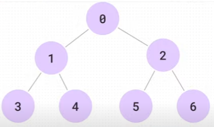

# 매일 알고리즘 정리

## 2024.08-02 (금) BFS 넓이우선탐색

넓이우선탐색

<p align="center">
  
</p>

DFS는 0 1 3 1 4 1 0 2 5 2 6 2 0 으로 탐색한다

BFS는 0 1 2 3 4 5 6 으로 돈다.

- 속도가 훨씬 빠르다.

### Queue

Queue가 비면 무한루프가 끝난다.

1. 0넣음
2. 0나감
3. 1, 2 들어감 Queue가 빌 때까지 내보냄
4. 1나감, 1이 갈 수 있는 곳 확인 0,3,4 / 0은 visited에 걸림 큐에 3,4 추가
5. 2나감, 2가 갈 수 있는 곳 확인 0,5,6 / 0은 visited에 걸림 큐에 5,6 추가
6. 현재 큐

<table>
<tr>
<th>입구</th>
<td>3 4 5 6</td>
<th>출구</th>
</tr>
</table>

### Queue자료구조
- q.front() : 맨 앞에 있는것 확인(리턴 O)
- q.push() : 맨뒤에 추가
- q.pop() : 맨 앞에 있는것 삭제(리턴 X)
- q.empty() : 비어있는지 확인


```c++
#include <iostream>
#include <queue>
using namespace std;

int visited[7];
int arr[7][7] = {
 0, 1, 1, 0, 0, 0, 0,
 1, 0, 0, 1, 1, 0, 0,
 1, 0, 0, 0, 0, 1, 1,
 0, 1, 0, 0, 0, 0, 0,
 0, 1, 0, 0, 0, 0, 0,
 0, 0, 1, 0, 0, 0, 0,
 0, 0, 1, 0, 0, 0, 0,
};

void bfs(int st) {
	queue<int> q;
	visited[st] = 1;
	q.push(st);
	while (!q.empty()) {
		int now = q.front();
		q.pop();
		for (int i = 0; i < 7; i++)
		{
			if (visited[i] == 1) continue;
			if (arr[now][i] == 0)continue;
			visited[i] = 1;
			q.push(i);
		}
		cout << now << " ";
	}g

}

int main() {
	bfs(0);
}
```

## 2024.08-01 (목) DFS2

### 2105. [모의 SW 역량테스트] 디저트 카페

- 시작점은 제시 X 모든점에서 시작한다.
- 시작점, 현재점, 방향
- 현재점이 초기점과 같다면 반환 (처음제외)
- 다음점이 범위밖이면 리턴
- DAT로 갔던 값이면 리턴 (갔던곳 또못감)
- 회전할 수 있으면 돌려서 DFS
- 직진 DFS

## 2024.07-31 (수) 트리, DFS, 그래프

이전까지의 재귀는 트리구조. 지금 배우는건 그래프 (시작점이 level이 아님.)

정점(노드), 간선(엣지), 비용(코스트)

그래프에서 DFS는 무한루프에 빠질 수 있다.

- visited : 방문했던 곳은 다시 가지 않는다.

```bash
0   0 1 1 1
1   1 0 0 1
2   0 1 0 1
3   0 0 0 0
```

> 각 노드들이 갈 수있는 노드에 1로 체크 자기자신은 못가는 경우.

```bash
   0  1  2  3

0  0 15 10 27
1  2  0  0  1
2  0  5  0  8
3  0  0  0  0
```

> 가중치 그래프 행렬

### 그래프의 경로 최댓값, 최솟값 구하기

> 간선의 가중치는 모두 1이다. st - > en가는 경로의 최솟값 최댓값

```c++
#define _CRT_SECURE_NO_WARNINGS
#include <iostream>
#include <algorithm>
#include <climits>

using namespace std;

int nodeCnt;
int arr[100][100];
int st, en;
int minCnt = INT_MAX;
int maxCnt;
int cnt;
int visited[100];
void func(int now) {
#define _CRT_SECURE_NO_WARNINGS
#include <iostream>
#include <algorithm>
#include <climits>

using namespace std;

int nodeCnt;
int arr[100][100];
int st, en;
int minCnt = INT_MAX;
int maxCnt;

int visited[100];
void func(int now, int cnt) {

	if (now == en) {
		minCnt = min(minCnt, cnt);
		maxCnt = max(maxCnt, cnt);
		return;
	}

	for (int i = 0; i < nodeCnt; i++)
	{
		if (visited[i] == 1)continue;
		if (arr[now][i] == 0)continue;


		visited[i] = 1;
		func(i, cnt+1);
		visited[i] = 0;


	}


}

int main() {

	freopen("input.txt", "r", stdin);
	cin >> nodeCnt;
	for (int i = 0; i < nodeCnt; i++)
	{
		for (int j = 0; j < nodeCnt; j++)
		{
			cin >> arr[i][j];
		}
	}

	cin >> st >> en;
	visited[st] = 1; //첫시작 방문처리
	func(st, 0);
	cout << minCnt << '\n' << maxCnt;

	return 0;
}
```

### 가중치 그래프의 경로 최댓값, 최솟값 구하기

> st - > en가는 경로의 최솟값 최댓값

```c++
#define _CRT_SECURE_NO_WARNINGS
#include <iostream>
#include <algorithm>
#include <climits>

using namespace std;

int nodeCnt;
int arr[100][100];
int st, en;
int minCnt = INT_MAX;
int maxCnt;

int visited[100];
void func(int now, int sum) {

	if (now == en) {
		minCnt = min(minCnt, sum);
		maxCnt = max(maxCnt, sum);
		return;
	}

	for (int i = 0; i < nodeCnt; i++)
	{
		if (visited[i] == 1)continue;
		if (arr[now][i] == 0)continue;


		visited[i] = 1;
		func(i, sum + arr[now][i]);
		visited[i] = 0;


	}


}

int main() {

	freopen("input.txt", "r", stdin);
	cin >> nodeCnt;
	for (int i = 0; i < nodeCnt; i++)
	{
		for (int j = 0; j < nodeCnt; j++)
		{
			cin >> arr[i][j];
		}
	}

	cin >> st >> en;
	visited[st] = 1; //첫시작 방문처리
	func(st, 0);
	cout << minCnt << '\n' << maxCnt;

	return 0;
}

```

### 벡터 사용하기

> 행렬으로 하는 방법은 메모리 낭비가 있다

> push_back, pop_back

```bash
v[0] : 1,2,3
v[1] : 0,3
v[2] : 1,3
```

입력이 행렬로 들어오면 그냥 행렬쓰자

하지만

```bash
0, 1
0, 2
0, 3
```

이런식으로 입력이 들어오면 벡터사용이 유리하다.

입력형식에 따라 맞는 것 사용하자.

### 가중치 없는 그래프의 벡터 사용하기

```c++
#define _CRT_SECURE_NO_WARNINGS
#include <iostream>
#include <algorithm>
#include <climits>
#include <vector>
#include <string>
#include <cmath>
#include <cstring>

using namespace std;

int nodeCnt, edgeCnt;
vector<int> v[100];

int st, en;
int visited[100];
int minCnt = INT_MAX;
int maxCnt;

void func(int now, int cnt) {
	if (now == en) {
		minCnt = min(minCnt, cnt);
		maxCnt = max(maxCnt, cnt);
		return;
	}

	for (int i = 0; i < v[now].size(); i++)
	{
		int to = v[now][i];
		if (visited[to] == 1)continue;

		visited[to] = 1;
		func(to, cnt + 1);
		visited[to] = 0;
	}
}

int main() {
	freopen("input.txt", "r", stdin);

	cin >> nodeCnt>>edgeCnt;
	for (int i = 0; i < edgeCnt; i++)
	{
		int from;
		int to;
		cin >> from>>to;
		v[from].push_back(to);
	}

	cin >> st >> en;
	visited[st] = 1;
	func(st, 0);

	cout << minCnt << '\n' << maxCnt;
	return 0;
}
```

### 가중치 있는 그래프의 벡터 사용하기

구조체를 사용해서 벡터에 푸쉬한다.

```c++
struct edge {
	int to;
	int cost;
}

vector<edge> v[1000];

for (int i = 0; i < edgeCnt; i++)
{
	int from, to, cost;
	cin >> from >> to >> cost;
	v[from].push_back({to, cost});
}
```

### 그래프 순회(전위/중위/후위)

전위는 그냥 재귀에 앞쪽/ 후위는 뒷쪽에 프린트 now찍으면된다.
중위가 문제.
중위는 플래그를 써야한다

### 중위

```c++


```

## 2024.07-30 (화) 백트래킹2 🤔🤔

백트래킹 - 결과를 알고 재귀함수의 탈출조건을 마련하는 것이 백트래킹이라고 생각...

### 복습1: 주사위를 N번 던져서 M에 따른결과 출력

> 주사위, 카드문제는 기본 중에 기본이다.

> 잊지 않도록 반복학습하자.

```c++
#define _CRT_SECURE_NO_WARINGS
#include <iostream>
#include <cstring>
#include <algorithm>
#include <string>
#include <cmath>
#include <vector>

using namespace std;
int M;
int N;
int dice[6] = { 1,2,3,4,5,6 };
int path[10] = { -1 };
int isvisited[6];
void func(int level, int M)
{
	if (level == N) {
		for (int i = 0; i < N; i++) //Path에 저장된 내 길을 출력
		{
			cout << path[i] << " ";
		}
		cout << '\n';
		return;
	}

	if (M == 1) { //1번모드일때 , 모든 경우의 수 출력
		for (int i = 0; i < 6; i++)
		{

			path[level] = dice[i];
			func(level + 1, M);
			path[level] = 0;
		}
	}
	else if (M == 2) {
		for (int i = 0; i < 6; i++)
		{
			if (level != 0 && path[level - 1] >dice[i]) {
				continue;
			}
			path[level] = dice[i];
			func(level + 1, M);
			path[level] = 0;
		}

	}
	else if (M == 3) {
		for (int i = 0; i < 6; i++)
		{
			if (isvisited[i] == 1) {
				continue;
			}
			isvisited[i] = 1;
			path[level] = dice[i];
			func(level + 1, M);
			path[level] = 0;
			isvisited[i] = 0;
		}
	}

}
int main() {

	cin >> N >> M;


	func(0, M);


	return 0;
}
```

### N-Queen 매우 중요하다. 기본중의 기본

- N을 입력받는다
- N\*N 체스판에 퀸을 N개 두는 경우의 수는 몇개인가?
- 퀸은 상하좌우,대각선 모두 이동가능하다.| \ / -

> 컨셉을 잘잡아야한다. N-castle의 확장판

```c++
#include <iostream>

using namespace std;

int visited[15]; // 열 방문 확인
int slash[30]; // '/' 대각선 방문 확인
int backslash[30]; // '\' 대각선 방문 확인
int N;
int resultcount = 0;

void func(int level) {
	if (level == N) {
		resultcount++;
		return;
	}

	for (int i = 0; i < N; i++) {
		if (visited[i] || slash[level + i] || backslash[level - i + N - 1]) {
			continue;
		}

		visited[i] = slash[level + i] = backslash[level - i + N - 1] = 1;
		func(level + 1);
		visited[i] = slash[level + i] = backslash[level - i + N - 1] = 0;
	}
}

int main() {
	cin >> N;

	func(0);

	cout << resultcount;
	return 0;
}

```

너무어렵다. 이해하도록 노력해보자

- 다빈치타워 문제.
- 좋은 수열 문제

## 2024.07-29 (월) 백트래킹1 🤔🤔

> recursion의 연장선

### **Path**

- 경로기억하기 -> 왔던 길을 기억해야한다.

```c++
#define _CRT_SECURE_NO_WARNINGS
#include <iostream>
#include <cstring>
#include <string>
#include <algorithm>
#include <vector>

using namespace std;
int N;

int path[2] = { -1, -1 };

void func(int level) {
	if (level == N) return;

	for (int i = 0; i < 2; i++)
	{
		path[level] = i;
		func(level + 1);
		path[level] = -1;

	}

}
int main() {
	//freopen("input.txt", "r", stdin);

	cin >> N;
	func(0);

}
```

> path에 내 위치 넣고 반환하고...

### path를 매개변수로 넣으면 되지않냐?

-> 배열은 call by reference 주소를 넘긴다.
손상이 된다.

그냥 전역변수로 선언해라 -> 어차피 유지안된다.

기록했다가 원상복구하고. 반복

### Path를 구해서 어디에쓰냐?

경로를 구해서 가지수 구하기.

### 가지치기의 두가지 방법.

### 1. for loop 안에서 조건이 맞으면 continue처리

```c++
    for (int i = 0; i < 6; i++)
    {
        if(i==3){ //3이면 넘긴다.
            continue;
        }
        path[level] = i;
        func(level + 1, M);
        path[level] = -1;
    }
```

### 2. 들어가고 즉시 나간다. 재귀함수 최 상단에 if로 처리 return

```c++
    if(level==3){ //3이면 넘긴다.
        return;
    }
    for (int i = 0; i < 6; i++)
    {

        path[level] = i;
        func(level + 1, M);
        path[level] = -1;
    }
```

### visited 매우 중요

> 왔던 곳이면 가지마라.

```c++
    for (int i = 0; i < 6; i++)
    {
        if (visited[i] == 1) {
            continue;
        }
        visited[i] = 1;
        path[level] = i;
        func(level + 1, M);
        path[level] = -1;
        visited[i] = 0;
    }
```

### 2차원 visited - 지나온 길(맵)

visited[3][4] ==1;

### 주사위 N번 던지는 경우의 수 문제!!기초
