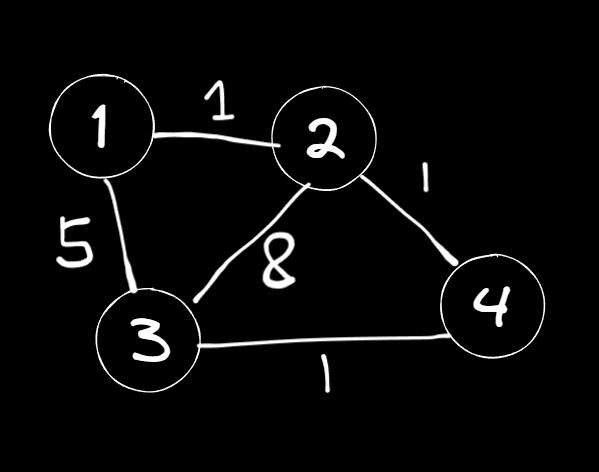
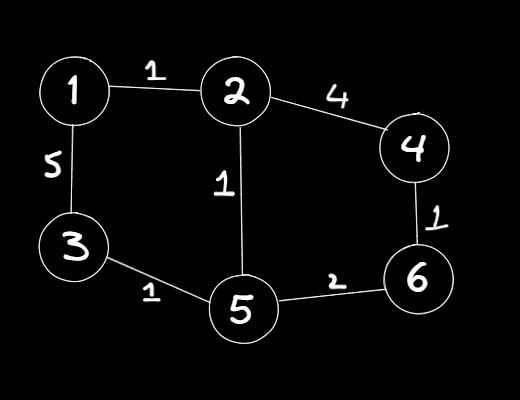

# 매일 알고리즘 정리

## 2024.08-20 (화)

### Priority Queue

- Queue는 FIFO원칙이지만 PQ는 내가 우선순위를 정한다

기본 라이브러리 퀵소트

```c++
#include <iostream>
#include <algorithm>

using namespace std;

bool compare(int a, int b)
{
    // 오름차순
    // return a < b;
    // 내림차순
    // return a > b;
}

int main()
{
    int arr[6] = { 3, 2, 4, 1, 5, 7, };

    sort(arr, arr + 6, compare);

    for (int i = 0; i < 6; i++)
    {
        cout << arr[i] << ' ';
    }
    cout << '\n';
    return 0;
}
```

PQ는 이름만 Queue고 Queue가 아니다. max heap이다

넣으면 정렬되더라.

1. 데이터를 집어넣어가면서 정렬을 유지해야할때

2. 다익스트라(PQ)

정렬

1. 오름차순
2. 내림차순 (PQ의 기본)
3. 커스텀

```c++
#include <iostream>
#include <queue>
#include <vector>
using namespace std;

//priority_queue<int, vector<int>, greater<int>> pq;

struct compare {
	bool operator()(int a, int b) {
		return a < b;
	}
};

priority_queue<int, vector<int>, compare> pq;

int main() {
	pq.push(1);
	pq.push(3);
	pq.push(2);
	pq.push(4);

	while (!pq.empty()) {
		cout << pq.top()<<'\n';
		pq.pop();
	}
}
```

struct안에 operator()함수로 정의한다.

아래 외워라

```c++
struct compare {
	bool operator()(int a, int b) {
		return a < b;
	}
};

priority_queue<int, vector<int>, compare> pq;
```

부등호는 sort의 compare함수와 반대이다.

퀵소트, 힙소트

```c++
#include <iostream>
#include <queue>
#include <vector>
#include <string>

using namespace std;

struct Member
{
	int id;
	string name;
};

struct compare {
	bool operator()(Member m1, Member m2)
	{
		if (m1.id == m2.id) return m1.name > m2.name;
		return m1.id > m2.id;
	}
};

priority_queue<Member, vector<Member>, compare> pq;

int main()
{
	pq.push({ 1,"라" });
	pq.push({ 5,"나" });
	pq.push({ 1,"가" });
	pq.push({ 3,"다" });

	while (pq.size())
	{
		cout << pq.top().id << ' ' << pq.top().name << ' ';
		pq.pop();
	}
}
```

## 2024.08-21 (수)

### Dijkstra 다익스트라

<p align="center">
  
</p>

- dijkstra를 안쓰고 최단거리를 구해라

```c++
#include <iostream>
#include <queue>
using namespace std;

int map[4][4] = {
	0,1,5,0,
	1,0,8,1,
	5,8,0,1,
	0,1,1,0
};
int visited[4];
int ep = 2;//3이니까 2번인덱스
int sp = 0;

int result = 21e8;
void dfs(int cp, int cost) {
	if (cp == 2) {
		result = min(result, cost);
	}

	for (int i = 0; i < 4; i++)
	{
		if (map[cp][i] == 0)continue;//못감

		if (visited[i] == 1)continue;
		else {
			visited[i] = 1;
			dfs(i, cost + map[cp][i]);
			visited[i] = 0;
		}
	}
}

int main() {
	dfs(sp,0);
	cout << result;
}
```

<p align="center">
  
</p>

- 모든 정점으로 가는 경로를 미리 계산하기!!!

-
